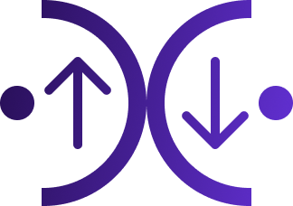

<a name="readme-top"></a>

<div align="center">

[![Angular][Angular-shield]][Angular-url]
[![PrimeNG][PrimeNG-shield]][PrimeNG-url]
[![Swiper][Swiper-shield]][Swiper-url]
[![Docker][Docker-shield]][Docker-url]
[![TypeScript][TypeScript-shield]][TypeScript-url]

</div>

<br />
<div align="center">
  <a href="https://github.com/tu-usuario/loki">
    
  </a>

  <h3 align="center">Loki E-Commerce</h3>

  <p align="center">
    Plataforma moderna de compra-venta con sistema de negociación.
    <br />
    Tesis Universitaria - Tecnicatura Universitaria en Programación
    <br />
    <br />
    <a href="#getting-started"><strong>Explorar la documentación »</strong></a>
    <br />
    <br />
    <a href="http://localhost:4200">Ver Demo</a>
    ·
    <a href="https://github.com/tu-usuario/loki/issues">Reportar Bug</a>
    ·
    <a href="https://github.com/tu-usuario/loki/issues">Solicitar Feature</a>
  </p>
</div>

<details>
  <summary>Tabla de Contenidos</summary>
  <ol>
    <li>
      <a href="#about-the-project">Sobre el Proyecto</a>
      <ul>
        <li><a href="#built-with">Tecnologías</a></li>
      </ul>
    </li>
    <li>
      <a href="#getting-started">Comenzando</a>
      <ul>
        <li><a href="#prerequisites">Prerrequisitos</a></li>
        <li><a href="#installation">Instalación</a></li>
      </ul>
    </li>
    <li><a href="#development-workflow">Flujo de Trabajo (Docker)</a></li>
    <li><a href="#roadmap">Roadmap</a></li>
    <li><a href="#contact">Contacto</a></li>
  </ol>
</details>

## 🛒 Sobre el Proyecto

**Loki** es una plataforma de comercio electrónico diseñada para conectar compradores y vendedores en un entorno dinámico. A diferencia de los e-commerce tradicionales, Loki incorpora un sistema de ofertas y contra-ofertas que permite la negociación en tiempo real.

El proyecto destaca por su arquitectura moderna, utilizando la última versión de **Angular (v20)** con Signals y Standalone Components, estilizado con **PrimeNG v20 (Aura Theme)**, carruseles táctiles con **Swiper**, y ejecutándose en un entorno completamente aislado mediante **Docker**.

<p align="right">(<a href="#readme-top">volver arriba</a>)</p>

### 🛠️ Tecnologías (Built With)

* [![Angular][Angular-shield]][Angular-url]
* [![PrimeNG][PrimeNG-shield]][PrimeNG-url]
* [![Swiper][Swiper-shield]][Swiper-url]
* [![Docker][Docker-shield]][Docker-url]
* [![TypeScript][TypeScript-shield]][TypeScript-url]
* **JSON Server** (Mock Backend)
* **RxJS** & **Signals**

<p align="right">(<a href="#readme-top">volver arriba</a>)</p>

## 🚀 Comenzando (Getting Started)

Lo mejor de este proyecto es su portabilidad. **NO necesitas tener Node.js ni Angular CLI instalados en tu máquina local.** Todo corre dentro de contenedores.

### Prerrequisitos

Solo necesitas tener instalado:

* **Git**
* **Docker Desktop** (Windows/Mac) o **Docker Engine** (Linux)

### Instalación

1.  **Clonar el repositorio**
    ```sh
    git clone [https://github.com/tu-usuario/loki.git](https://github.com/tu-usuario/loki.git)
    cd loki
    ```

2.  **Configuración de Docker (Solo Windows/Mac)**
    * Asegúrate de que Docker tenga permisos para leer la carpeta del proyecto en:
    `Settings` -> `Resources` -> `File Sharing`.

3.  **Levantar el entorno**
    Ejecuta el siguiente comando. La primera vez puede tardar unos minutos en construir la imagen.
    ```sh
    docker compose up --build
    ```

4.  **Acceder a la aplicación**
    * Frontend: [http://localhost:4200](http://localhost:4200)
    * API Mock: [http://localhost:3000](http://localhost:3000)

<p align="right">(<a href="#readme-top">volver arriba</a>)</p>

## 💻 Flujo de Trabajo (Cheat Sheet)

Dado que no usamos Node local, utilizamos comandos de Docker para gestionar las dependencias y el entorno.

### 📦 Instalación de Librerías Clave

Si necesitas reinstalar el entorno o agregar las dependencias principales, usa estos comandos dentro de Docker:

**Instalar PrimeNG + Iconos + Temas:**
```sh
docker compose run --rm angular-loki npm install primeng @primeuix/themes primeicons --save --legacy-peer-deps
```
### 🔴 Solucionar "Líneas Rojas" en VS Code
Si VS Code marca errores en los imports (porque no tienes las librerías en tu disco físico), ejecuta este comando para copiar los `node_modules` del contenedor a tu máquina:

```bash
# Ejecutar en la raíz del proyecto
docker cp angular-loki:/app/node_modules ./frontend

# (Solo Linux) Si tienes errores de permisos después de copiar:
sudo chown -R $USER:$USER ./frontend/node_modules
```

### 🧹 Limpieza total
Si tienes errores extraños de dependencias o permisos:

```bash
docker compose down -v
docker compose up --build
```
<p align="right">(<a href="https://www.google.com/search?q=%23readme-top">volver arriba</a>)</p>

### 🗺️ Roadmap
[x] Configuración de Docker y Ambiente

[x] Integración de PrimeNG v20 (Tema Violeta)

[x] Dashboard de Vendedor (Tabs, Tablas, Gráficos)

[x] Gestión de Productos (Alta, Baja, Modificación)

[ ] Sistema de Carrito de Compras

[ ] Lógica de Negociación (Ofertas)

[ ] Autenticación y Roles (User/Seller)

<p align="right">(<a href="https://www.google.com/search?q=%23readme-top">volver arriba</a>)</p>

### 👥 Autores
Diego Maidana - https://www.linkedin.com/in/die-maidana/

Lucas Camino - https://www.linkedin.com/in/lucas-camino-0808231b6/

<p align="right">(<a href="https://www.google.com/search?q=%23readme-top">volver arriba</a>)</p>

[Angular-shield]: https://img.shields.io/badge/angular-%23DD0031.svg?style=for-the-badge&logo=angular&logoColor=white
[Angular-url]: https://angular.io/
[PrimeNG-shield]: https://img.shields.io/badge/PrimeNG-v20-%235F2ECC?style=for-the-badge
[PrimeNG-url]: https://primeng.org/
[Docker-shield]: https://img.shields.io/badge/docker-%230db7ed.svg?style=for-the-badge&logo=docker&logoColor=white
[Docker-url]: https://www.docker.com/
[TypeScript-shield]: https://img.shields.io/badge/typescript-%23007ACC.svg?style=for-the-badge&logo=typescript&logoColor=white
[TypeScript-url]: https://www.typescriptlang.org/
[Swiper-shield]: https://img.shields.io/badge/Swiper-%236332F6?style=for-the-badge&logo=swiper&logoColor=white
[Swiper-url]: https://swiperjs.com/